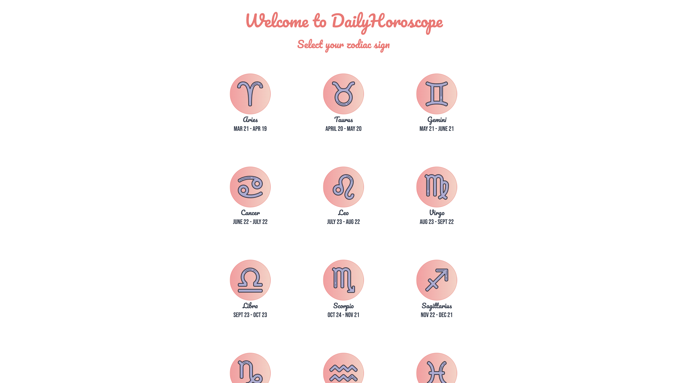
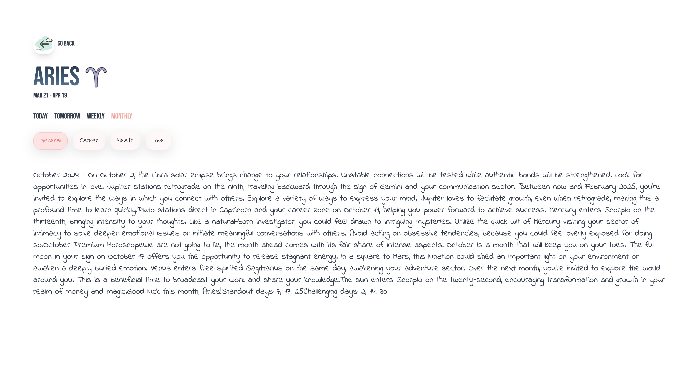

# Daily Horoscope

Welcome to the Daily Horoscope. This application allows users to explore their horoscopes based on their zodiac signs. With daily, tomorrow, weekly, and monthly forecasts, users can gain insights into various aspects of their lives, including general guidance, career, health, and love.




## Features

- **Zodiac Sign Selection**: Choose your zodiac sign from a user-friendly interface.
- **Daily Horoscopes**: Get the horoscope for today tailored to your sign.

- **Weekly & Monthly Horoscopes**: Explore forecasts for the week and the month ahead.

- **Categories**: Delve into specific categories for a more focused reading.

## Demo

[https://daily-horoscope-eta.vercel.app](https://daily-horoscope-eta.vercel.app)

## Installation

Clone the repository:

```bash
git clone https://github.com/piyush-rawat/daily-horoscope.git
```

Navigate to the project directory

```bash
cd daily-horoscope
```

Install the dependencies

```bash
npm install
```

Run the project

```bash
npm run dev
```

## Web Scraping

This project utilizes Cheerio for web scraping to gather horoscope data from a reliable source. Cheerio allows us to parse and manipulate HTML efficiently, enabling us to extract the necessary information for each zodiac sign.

### Data Source

The horoscope data is scraped from https://www.horoscope.com

## Technologies and Frameworks Used

- Next.js
- Tailwindcss
